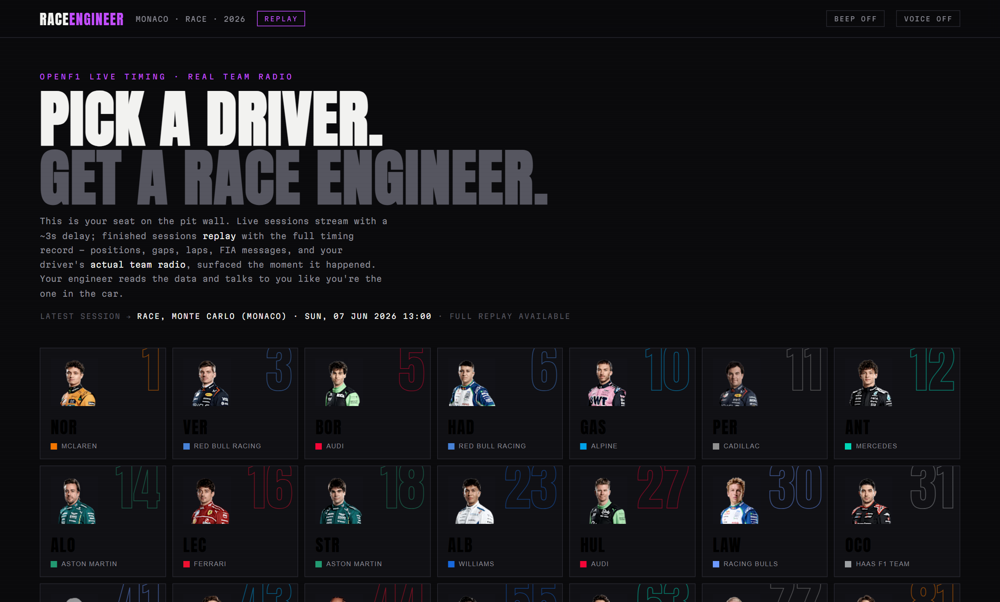
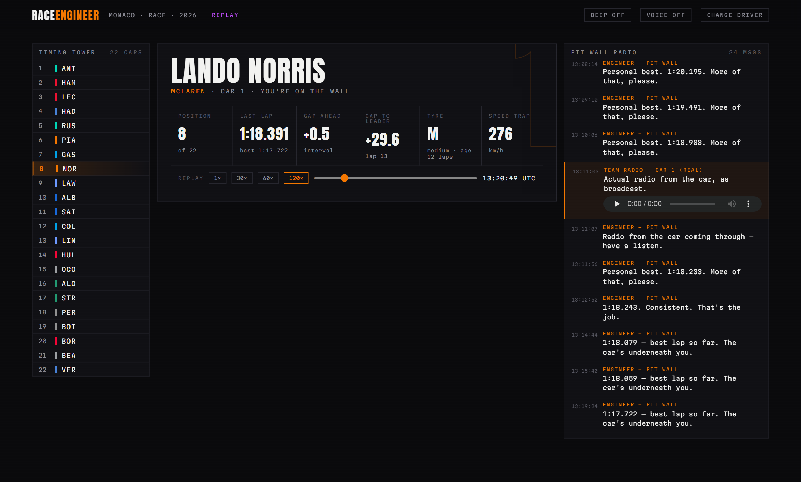

# RACE ENGINEER 🏎️📻

**Pick a driver. Get a race engineer.**

A single-file web app that puts you on the F1 pit wall. It connects to [OpenF1](https://openf1.org) live timing, auto-follows the latest session (live during race weekends, full replay after), and gives you an AI race engineer who reads the data and actually talks to you - plus your driver's **real team-radio recordings**, surfaced at the exact moment they happened.

**Live:** https://f1-race-engineer.vercel.app

## What you get

- **Timing tower** - all 22 cars, live positions, team colours
- **Your car's tiles** - position, last lap vs personal best, gap ahead, gap to leader, tyre compound + age, speed trap
- **The engineer** - generated radio calls off the live data: position changes, gaps closing, personal bests, safety cars, flags, and the occasional dry remark ("Quiet is good. Quiet means fast.")
- **Real team radio** - the actual broadcast MP3s for your driver, playable inline as they occur
- **Replay deck** - 1× to 120× speed + full seek for finished sessions
- **Beep + voice toggles** - radio chirps and speech-synthesis delivery of the engineer's lines

## How it works

One HTML file. No build, no framework, no keys.

- `sessions?session_key=latest` decides live vs replay
- Everything (positions, intervals, laps, race control, team radio, stints) is date-stamped, so one **data clock** drives both modes: live = now, replay = accelerated time
- OpenF1's free tier rate-limits aggressively → all requests go through a serialized queue (~400ms spacing) with 429 backoff

## Run it

Open `index.html`. That's it.

`_verify.py` is a Playwright harness that loads the app, joins a pit wall, fast-forwards the replay, and screenshots desktop + mobile.

## Why

F1 was on. I wanted my own engineer. Built in one night with live data and zero practical purpose - which was the point.

---

Built by [Asadulelah](https://github.com/Asadulelah). Data by [OpenF1](https://openf1.org) (unofficial, non-commercial). Not affiliated with Formula 1.
